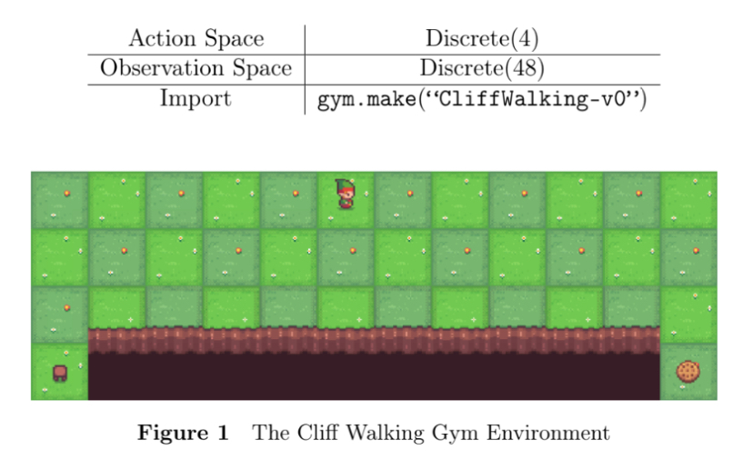

# CliffWalking with Tabular Q-Learning

This repository implements a reinforcement learning agent using **Tabular Q-Learning**
to navigate the `CliffWalking-v0` environment provided by OpenAI Gym.

The objective is to train an agent to reach a goal on a 4×12 grid while avoiding a
dangerous cliff region that causes heavy penalties and resets.

Two variants of the learning strategy are implemented:

- **Greedy policy** (no explicit exploration)
- **Epsilon-greedy policy** with linear decay

The agent learns optimal behavior through repeated interaction with the environment,
gradually improving its decision-making using Q-values.

---

## 🗺 Environment Overview

The CliffWalking environment is represented as a 4×12 grid:

- `S` → Start position  
- `G` → Goal position  
- `X` → Cliff cells (large negative reward + reset)

At each step:
- Moving yields **-1 reward**
- Falling off the cliff yields **-100 reward**

---

## 🎯 Learning Objective

The agent must:
- Reach the goal efficiently
- Avoid the cliff
- Minimize total negative reward

⸻

🚀 Running the Code

Greedy version

python q_learning_greedy.py

Epsilon-greedy version

python q_learning_epsilon.py

Plots will appear automatically showing rewards per episode.

⸻

🔁 Q-Learning Update Rule

The agent updates its Q-values based on the Bellman optimality equation:

[
Q(s,a) \leftarrow Q(s,a) + \alpha [r + \gamma \max_{a’} Q(s’,a’) - Q(s,a)]
]

Where:
	•	α = learning rate
	•	γ = discount factor
	•	r = reward
	•	s′ = next state

⸻

⚠️ Exploration vs Exploitation

Pure greedy policies can become stuck in suboptimal behavior.

To avoid this, the epsilon-greedy method:
	•	Uses random actions early (exploration)
	•	Gradually reduces randomness (decay)
	•	Exploits knowledge later

⸻

📈 Training Results

Both implementations produce a plot of episode return across training.

Typical behavior observed:
	•	Greedy strategy learns slowly and often takes safe but longer paths
	•	Epsilon-greedy converges to a shorter, more optimal route

Example learning curve:

(optional image if you export plots)

⸻

📊 Evaluation

After training, the agent is tested without exploration:
	•	Always selects the highest-valued action
	•	Runs for multiple episodes
	•	Success rate and average returns are printed

⸻

🧰 Hyperparameters

Parameter	Value
Episodes	1000
Learning rate α	0.5
Discount γ	0.9
ε initial	1.0
ε decay	0.001

Feel free to experiment with them.

⸻

🧪 Experiment Ideas

You can expand this project by adding:
	•	SARSA comparison
	•	Different ε decay strategies
	•	Randomized start positions
	•	Visualization of agent trajectories
	•	Heatmaps of visited states

⸻

🧩 Key Concepts Demonstrated
	•	Reinforcement learning fundamentals
	•	Tabular value updates
	•	Exploration strategies
	•	Deterministic vs risky policy trade-offs
	•	Convergence behavior

⸻

🔧 Compatibility
	•	Gym (v0.26+) new step API supported
	•	Python 3.8+

⸻

Author
•	Mostafa Ahmed
